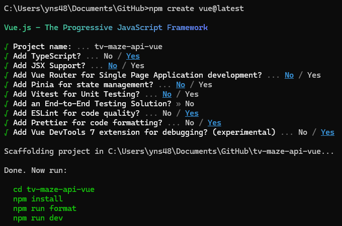

# tv-maze-api-vue

### Starting the Project

I used `npm create vue@latest` command to create project with minumum help. I will add features that I need later



## Instructions to run

I used node v18.20.2 and npm v10.5.0, Pls be sure using minimum these versions or above.

### Dont forget to install dependencies first

```sh
npm install
```

You can follow the commands below according to your needs

#### Compile and Hot-Reload for Development

```sh
npm run dev
```

#### Type-Check, Compile and Minify for Production

```sh
npm run build
```

#### Lint with [ESLint](https://eslint.org/)

```sh
npm run lint
```

## Steps

### Git Setup

I initialized the git, targeted my git repository and force pushed to skip main branch protection

```sh
git init
git remote add origin https://github.com/ynslmz/tv-maze-api-vue.git
git add -A
git commit -m 'init'
git checkout -b main
git push --set-upstream origin main  --force

```

### Adding Router

I followed the instructions on the [documentation](https://router.vuejs.org/installation.html)

```sh
 npm add vue-router@4
```

I added a router file, views to navigate with lazy loading and configured App component and the entry point

### Adding Sass and setting up styles

I set up sass for style sheets and added some configuration to make style sheets available in components 

```sh
 npm add sass --save-dev
```

