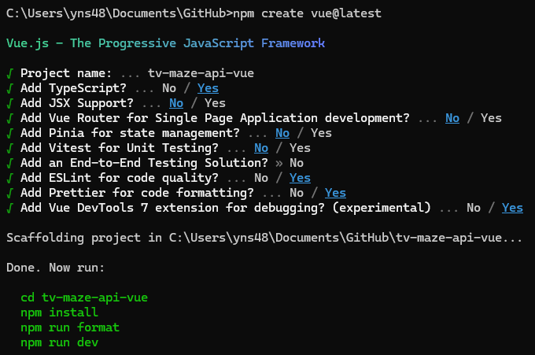

# TV Maze Dashboard

A responsive TV‑show dashboard built with **Vue 3** and the public [TVMaze API](https://www.tvmaze.com/api). Shows are grouped into horizontal, genre‑based rows, sorted by rating within each genre. Selecting a show opens a detailed screen (info, cast, episodes), and a debounced search lets users look up shows by name.

**Live demo:** https://ynslmz.github.io/tv-maze-api-vue



> The screenshot above is illustrative — regenerate it against your local build if the UI has changed.

## Features

- **Genre rows, sorted by rating** — the TVMaze "Show index" has no genre endpoint, so shows are grouped by genre and ordered by `rating.average` (descending) on the client.
- **Genre filter** — a chip bar to focus the dashboard on a single genre (or *All*).
- **Show detail** — dedicated screen with tabbed *Main / Cast / Episodes* views.
- **Search by name** — debounced, keyboard‑navigable dropdown (arrow keys, Enter, Escape) with ARIA combobox/listbox semantics.
- **Resilient UX** — inline loading / empty / error states with retry; a failed request never ejects the user from the app.
- **Responsive** — mobile‑first layouts down to 375px, no horizontal page overflow.

## Architecture & key decisions

| Decision | Rationale |
| --- | --- |
| **Vue 3 + `<script setup>`** | The framework used at ABN AMRO. The Composition API keeps component logic terse and colocated, and `<script setup>` removes boilerplate. |
| **Vite** | Fast dev server and lean production builds; first‑class Vue + TypeScript support with minimal configuration. |
| **TypeScript** | The TVMaze payloads are modelled as explicit interfaces (`src/types/show.type.ts`), catching shape mismatches at compile time. |
| **Pinia setup store** (`src/store/show.ts`) | A single source of truth for shows, genre grouping, the current show, search results, pagination and the request lifecycle (loading/error). State is exposed directly (composition-style, no getter facade). All data‑shaping (rating sort + genre grouping) lives here so it is framework‑light and unit‑testable. |
| **In-component data composables** (`src/composables/useShowsData.ts`, `useShowData.ts`) | Views fetch through small composables on mount (watching `:id` for the detail route) rather than blocking `beforeEnter` guards — non-blocking navigation, colocated and testable, with the store's loading/error/empty states driving the UI. A genuinely missing show redirects to `/notfound`. |
| **Client‑side genre grouping** | TVMaze exposes no "shows by genre" endpoint, so the Show index is fetched once and pivoted into `{ [genre]: Show[] }`, each list pre‑sorted by rating. |
| **Hash history** | GitHub Pages serves static files with no SPA rewrite, so `createWebHashHistory` keeps deep links working without server config. |
| **Axios with a thin wrapper** (`src/api`) | A single client with one interceptor. Errors are propagated to callers (the store) rather than handled globally, so each feature can degrade independently. |
| **Runtime response validation** (`src/api/validators.ts`) | The wire is untyped, so responses are shape‑checked at the boundary instead of blindly asserted `as Show`. Malformed entries are dropped rather than propagating `undefined` into the UI. |
| **HTML sanitization** (`DOMPurify`) | Show summaries are HTML we do not control and are rendered with `v-html`. They are sanitized first to prevent XSS. DOMPurify is a small, security‑critical, single‑purpose library — the responsible choice over a hand‑rolled sanitizer. |

## Tech stack

Vue 3 · Vue Router 4 · Pinia · TypeScript · Vite · SCSS · Axios · DOMPurify · Vitest · Vue Test Utils · ESLint (flat config) · Prettier.

## Getting started

### Prerequisites

- **Node.js** `>= 20.19` (see [`.nvmrc`](.nvmrc) — run `nvm use` to match). Local development was done on Node 20/24.
- **npm** `>= 10`.

### Environment

Create a `.env` file from the sample and adjust if needed:

```sh
cp .env.sample .env
```

| Variable | Purpose | Example |
| --- | --- | --- |
| `VITE_API_URL` | TVMaze API base URL | `https://api.tvmaze.com` |
| `VITE_BASE_URL` | App base path (the GitHub Pages sub‑path in production) | `/` |

### Install & run

```sh
npm install       # install dependencies
npm run dev       # start the dev server (http://localhost:5173)
npm run build     # type-check + production build to dist/
npm run preview   # preview the production build locally
```

## Available scripts

| Script | Description |
| --- | --- |
| `npm run dev` | Start Vite dev server with HMR. |
| `npm run build` | Type‑check (`vue-tsc`) and build for production. |
| `npm run preview` | Serve the built `dist/` locally. |
| `npm run type-check` | Run the TypeScript type‑checker only. |
| `npm run lint` | Lint and auto‑fix with ESLint (flat config). |
| `npm run format` | Format `src/` with Prettier. |
| `npm run test` | Run the unit test suite once (CI‑safe). |
| `npm run test:watch` | Run tests in watch mode. |
| `npm run test:coverage` | Run tests with a V8 coverage report (enforces thresholds). |

## Testing

Unit tests use **Vitest** (jsdom environment) and **Vue Test Utils**, colocated with the code they cover (`*.spec.ts`). Coverage focuses on the parts most likely to break:

- **Store** (`src/store/show.ts`) — genre grouping, rating‑descending sort, null‑rating handling, cache guards, pagination bounds, and error state.
- **API** — service URL/query building (including query encoding) and boundary validators.
- **Utilities** — the debounce factory, rating formatter and HTML sanitizer.
- **Components / views** — `Pager`, `GenreNav`, the search dropdown’s keyboard navigation, and the dashboard’s loading/empty/error/filter states.

```sh
npm run test            # run once
npm run test:coverage   # HTML report in coverage/ + threshold gate
```

## Project structure

```
src/
├── api/          # axios client, TVMaze service, runtime validators
├── assets/       # global SCSS (variables, layout, reset)
├── components/   # reusable UI (ShowCard, GenreCard, GenreNav, Pager, layout/, shared/)
├── composables/  # useShowsData, useShowData (in-component data fetching)
├── router/       # route definitions
├── store/        # Pinia setup store (data + request lifecycle)
├── types/        # TVMaze domain interfaces
├── utils/        # debounce, formatRating, sanitizeHtml, constants, test mocks
└── views/        # DashboardView, DetailView (+ nested Main/Cast/Episodes), NotFoundView
```

## Deployment

Pushing to `main` triggers the GitHub Actions workflow in [`.github/workflows/deploy.yml`](.github/workflows/deploy.yml): it installs dependencies, runs the tests, builds with the production env, and publishes `dist/` to GitHub Pages.
